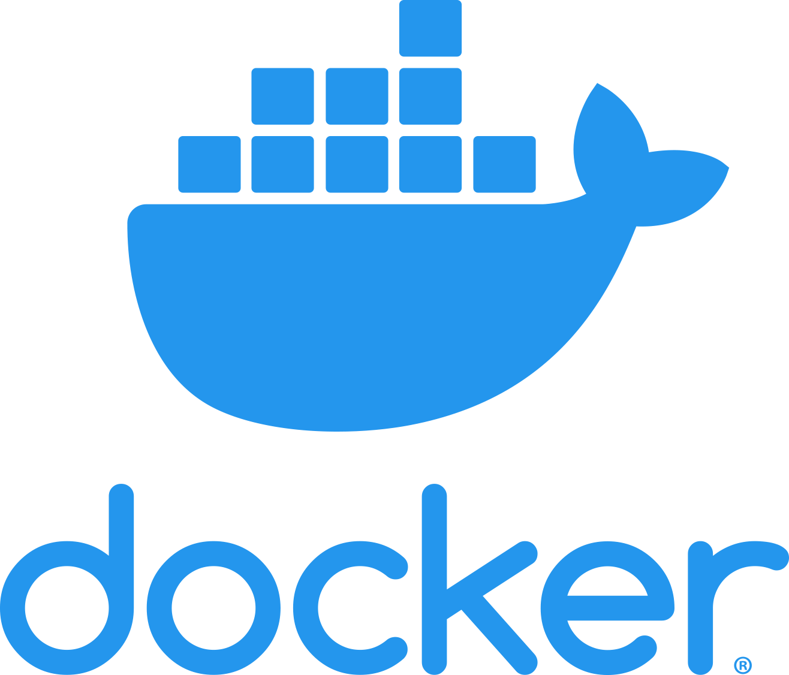
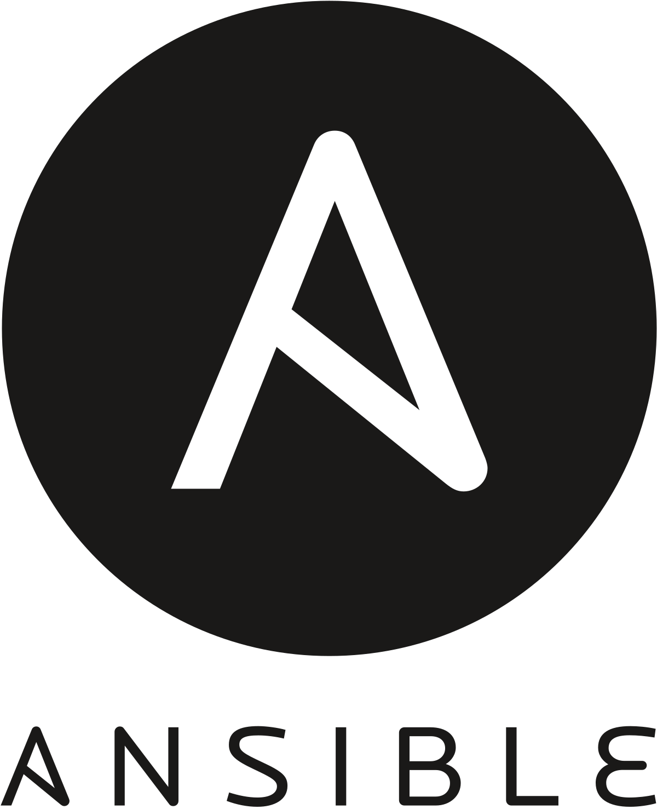
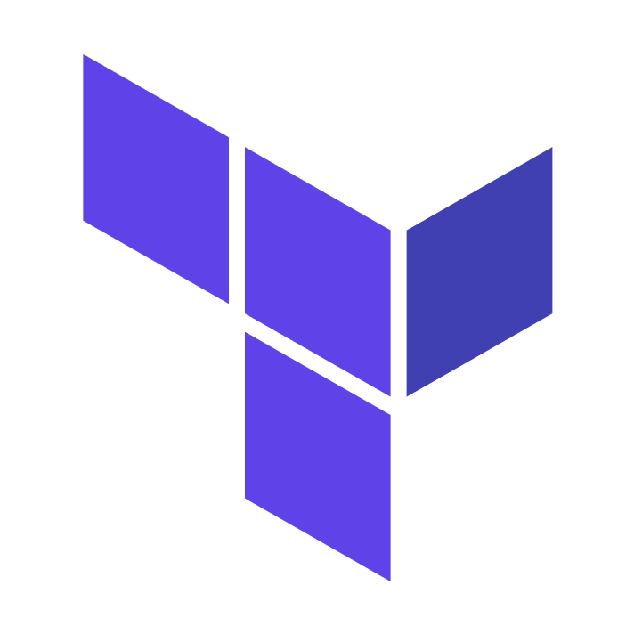
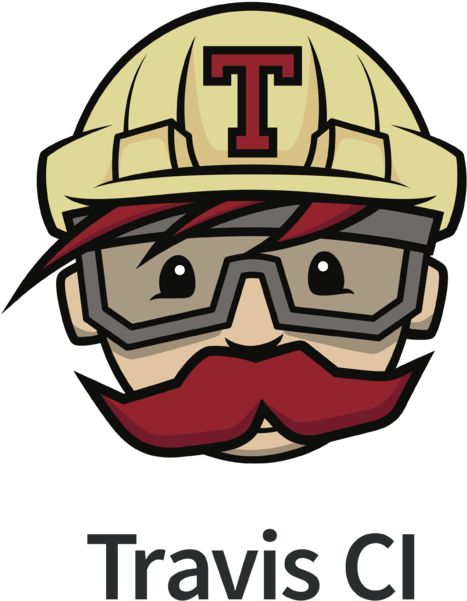

     

<!-- 

		<a href="https://triplebyte.com/a/UEmYALe/d">
		<b>Looking for a job?</b> 
			 
			No resume needed. Just prove you can code. Take Triplebyte’s quiz 
      and go straight to final onsite interviews!
			 
			

				
			

		</a>
	

	
	 -->
	
*******************

<table>
 <tr>
<td align="center"><a href="./Container-orchestration/Docker"> <b>Docker</b></a> <a href="./Container-orchestration/Docker/docker-concepts.md">Docker Concepts</a> <a href="./Container-orchestration/Docker/docker-notes.md">Docker Notes</a> <a href="./Container-orchestration/Docker">Docker Tutorial</a></td>
     <td align="center"><a href="./Container-orchestration/kubernetes"> <b>Kubernetes</b></a> <a href="./Container-orchestration/kubernetes/kuber-concepts.md">Kubernetes Concepts</a> <a href="./Container-orchestration/kubernetes/kubernetes-commands.md">Kubernetes Commands</a></td>
    <td align="center"><a href="./observability/Prometheus"> <b>Prometheus</b></a> <a href="./observability/Prometheus/prometheus-concepts.md">Prometheus Concepts</a> <a href="./observability/Prometheus/prometheus-tutorials.md">Prometheus Tutorial</a></td>
    <td align="center"><a href="./CI-CD/git"> <b>Git</b></a> <a href="./CI-CD/git">Git concepts</a> <a href="./CI-CD/git/git-advanced.md">Git Advanced</a></td>
    <td align="center"><a href="./Infrastructure-provisioning/Ansible"> <b>Ansible</b></a> <a href="./Infrastructure-provisioning/Ansible/ansible-concepts.md"> Ansible Concepts</a> <a href="./Infrastructure-provisioning/Ansible/ansible-tutorials.md"> Ansible Tutorials</a></td>
    <td align="center"><a href="./Infrastructure-provisioning/Terraform"> <b>Terraform </b></a> <a href="./Infrastructure-provisioning/Terraform/terraform-concepts.md">Terraform Concepts</a> <a href="./Infrastructure-provisioning/Terraform/terraform-tutorials.md"> Terraform Tutorials</a></td>
    <td align="center"><a href="./CI-CD/jenkins"> <b>Jenkins</b></a> <a href="./CI-CD/jenkins/jenkins-concepts.md">Jenkins Concepts</a> <a href="./CI-CD/jenkins/jenkins-tutorials.md">Jenkins Tutorials</a></td>
  </tr>
   
   
 </table>

   

<table>

   <tr>
    <td align="center"><a href="./OS"> <b>Linux</b></a> <a href="./OS/os-concepts.md">OS/Linux-Concepts</a> <a href="./OS/os-commands.md">Linux Commands</a></td>
     <td align="center"><a href="./Networking"> <b>Networking</b></a> <a href="./Networking/networking-concepts.md">Networking Concepts</a> <a href="./Networking/networking-commands.md">Networking Commands</a></td>
    <td align="center"><a href="./Books"> <b>Books</b></a> </td>
    <td align="center"><a href="./Interview"> <b>Interview </b></a> <a href="./Interview/Dev-ops-Interview.md">Interview Questions</a></td>
    <td align="center"><a href="./CI-CD/GitlabCi"> <b>Gitlab</b></a> <a href="./CI-CD/GitlabCi/gitlab-concepts.md">Gitlab Concepts</a> <a href="./CI-CD/GitlabCi/gitlab-commands.md">Gitlab Commands</a></td>
    <td align="center"><a href="./Infrastructure-provisioning/Puppet"> <b>Puppet</b></a> <a href="./Infrastructure-provisioning/Puppet/puppet-concepts.md">Puppet Concepts</a> <a href="./Infrastructure-provisioning/Puppet/puppet-commands.md">Puppet Commands</a></td>
    <td align="center"><a href="./Infrastructure-provisioning/Chef"> <b>Chef</b></a> <a href="./Infrastructure-provisioning/Chef/chef-concepts.md">Chef Concepts</a> <a href="./Infrastructure-provisioning/Chef/chef-commands.md">Chef Commands</a></td>
   
  </tr>
  
 </table>

 

<table>

   <tr>
    <td align="center"><a href="./CI-CD/TravisCi"> <b>Travis</b></a> <a href="./CI-CD/TravisCi/travis-concepts.md">Travis Concepts</a> <a href="./CI-CD/TravisCi/travis-commands.md">Travis Commands</a></td>
    <td align="center"><a href="./CI-CD/Actions"> <b>GitHub Actions</b></a> <a href="./CI-CD/Actions/github-actions-concepts.md">Actions Concepts</a> <a href="./CI-CD/Actions/github-actions-tutorial.md">Actions Tutorial</a></td>
    <td align="center"><a href="./CI-CD/CircleCI"> <b>CircleCI</b></a> <a href="./CI-CD/CircleCI/circleci-concepts.md">CircleCI Concepts</a> <a href="./CI-CD/CircleCI/circleci-commands.md">CircleCI Commands</a></td>
  </tr>
  
 </table>

********************

### Getting Started DevOps Links:

- [What is Devops - AWS](https://aws.amazon.com/devops/what-is-devops/)
- [What is DevOps - Logit.io](https://logit.io/blog/post/what-is-devops)
- [DevOps Roadmap by kamranahmedse](https://github.com/kamranahmedse/developer-roadmap/blob/master/public/roadmaps/devops.png)
- [Devops Roadmap by Nguyen Truong Duong](https://github.com/raycad/devops-roadmap)
- [Roadmap To devops](https://medium.com/faun/the-roadmap-to-become-a-devops-dude-from-server-to-serverless-dd97420f640e)
- [r/devops](https://www.reddit.com/r/devops/)
- [IBM Kubernetes Handson Labs](https://github.com/IBM/kube101/tree/master/workshop)
- [Getting Started With Azure DevOps](https://github.com/microsoft/azuredevopslabs)
- [Getting started with Google Cloud Platform](https://cloud.google.com/gcp/getting-started/)
- [Freecodecamp Devops Getting Started Articles](https://www.freecodecamp.org/news/tag/devops/)
- [The-devops-roadmap-for-programmers](https://dzone.com/articles/the-devops-roadmap-for-programmers)
- [DevOps Getting Started](https://medium.com/@devfire/how-to-become-a-devops-engineer-in-six-months-or-less-366097df7737)
- [How-to-get-started-with-devops](https://dev.to/liquid_chickens/how-to-get-started-with-devops)
- [Going-from-it-to-devops](https://medium.com/better-programming/going-from-it-to-devops-996192520331)
- [How to Become a DevOps Engineer in Six Months](https://spacelift.io/blog/how-to-become-devops-engineer)
- [Who is DevOps? Is it Worth it to Become a DevOps Engineer?](https://spacelift.io/blog/who-is-devops-engineer)
  
**************************

## Contributors ✨

Thanks goes to these wonderful people ([emoji key](https://allcontributors.org/docs/en/emoji-key)):

<!-- ALL-CONTRIBUTORS-LIST:START - Do not remove or modify this section -->
<!-- prettier-ignore-start -->
<!-- markdownlint-disable -->
<table>
  <tr>
    <td align="center"><a href="http://www.ghostwheel.co.uk"> <b>Neil Duncan</b></a> <a href="https://github.com/Tikam02/DevOps-Guide/commits?author=neilduncan" title="Documentation">📖</a></td>
    <td align="center"><a href="https://github.com/cuzza0"> <b>cuzza0</b></a> <a href="https://github.com/Tikam02/DevOps-Guide/commits?author=cuzza0" title="Documentation">📖</a></td>
    <td align="center"><a href="https://adrianmoisey.gitlab.com/"> <b>Adrian Moisey</b></a> <a href="https://github.com/Tikam02/DevOps-Guide/commits?author=adrianmoisey" title="Documentation">📖</a></td>
    <td align="center"><a href="https://github.com/Win32Sector"> <b>Pavel Kozlov</b></a> <a href="#question-Win32Sector" title="Answering Questions">💬</a></td>
    <td align="center"><a href="https://github.com/milap-neupane"> <b>Milap Neupane</b></a> <a href="https://github.com/Tikam02/DevOps-Guide/commits?author=milap-neupane" title="Code">💻</a> <a href="#tutorial-milap-neupane" title="Tutorials">✅</a></td>
    <td align="center"><a href="https://johnoctubre.me/"> <b>john</b></a> <a href="https://github.com/Tikam02/DevOps-Guide/commits?author=johnoct" title="Documentation">📖</a></td>
    <td align="center"><a href="https://www.linkedin.com/in/jobin-george-364bbb127/"> <b>Jobin George</b></a> <a href="https://github.com/Tikam02/DevOps-Guide/commits?author=jobintweets" title="Documentation">📖</a></td>
  </tr>
  <tr>
    <td align="center"><a href="https://github.com/tsyr2ko"> <b>tsyr2ko</b></a> <a href="https://github.com/Tikam02/DevOps-Guide/commits?author=tsyr2ko" title="Documentation">📖</a></td>
    <td align="center"><a href="https://twitter.com/VictorNS69"> <b>Víctor Nieves Sánchez</b></a> <a href="https://github.com/Tikam02/DevOps-Guide/commits?author=VictorNS69" title="Documentation">📖</a></td>
    <td align="center"><a href="https://blog.acropanda.top/"> <b>Frank</b></a> <a href="https://github.com/Tikam02/DevOps-Guide/commits?author=acrofrank" title="Documentation">📖</a></td>
    <td align="center"><a href="https://medium.com/@asadmansoor"> <b>Asad Mansoor</b></a> <a href="https://github.com/Tikam02/DevOps-Guide/commits?author=asadmansr" title="Documentation">📖</a></td>
    <td align="center"><a href="https://angristan.xyz"> <b>Stanislas</b></a> <a href="https://github.com/Tikam02/DevOps-Guide/commits?author=angristan" title="Documentation">📖</a></td>
    <td align="center"><a href="https://www.linkedin.com/in/rodrigofazenda/"> <b>Rodrigo Fazenda</b></a> <a href="https://github.com/Tikam02/DevOps-Guide/commits?author=rodrigofazenda" title="Documentation">📖</a></td>
    <td align="center"><a href="https://github.com/nkstanchev"> <b>Nikolay Stanchev</b></a> <a href="https://github.com/Tikam02/DevOps-Guide/commits?author=nkstanchev" title="Documentation">📖</a></td>
  </tr>
  <tr>
    <td align="center"><a href="https://github.com/meet59patel"> <b>Meet Patel</b></a> <a href="https://github.com/Tikam02/DevOps-Guide/commits?author=meet59patel" title="Code">💻</a></td>
    <td align="center"><a href="https://shenxianpeng.github.io"> <b>shenxianpeng</b></a> <a href="https://github.com/Tikam02/DevOps-Guide/commits?author=shenxianpeng" title="Documentation">📖</a></td>
    <td align="center"><a href="https://github.com/Umang2002"> <b>Umang Dobariya</b></a> <a href="https://github.com/Tikam02/DevOps-Guide/commits?author=Umang2002" title="Documentation">📖</a></td>
    <td align="center"><a href="https://github.com/Revenge-Rakesh"> <b>Rakesh .B</b></a> <a href="https://github.com/Tikam02/DevOps-Guide/commits?author=Revenge-Rakesh" title="Documentation">📖</a></td>
    <td align="center"><a href="https://github.com/fedGL"> <b>Federico Garcia-Lorca</b></a> <a href="https://github.com/Tikam02/DevOps-Guide/commits?author=fedGL" title="Documentation">📖</a></td>
    <td align="center"><a href="https://github.com/kawaiipantsu"> <b>Dave</b></a> <a href="https://github.com/Tikam02/DevOps-Guide/commits?author=kawaiipantsu" title="Documentation">📖</a></td>
    <td align="center"><a href="https://listout.github.io/mysite/"> <b>Brahmajit</b></a> <a href="https://github.com/Tikam02/DevOps-Guide/commits?author=listout" title="Documentation">📖</a> <a href="https://github.com/Tikam02/DevOps-Guide/commits?author=listout" title="Code">💻</a></td>
  </tr>
  <tr>
    <td align="center"><a href="https://milindchawre.github.io/"> <b>Milind Chawre</b></a> <a href="https://github.com/Tikam02/DevOps-Guide/commits?author=milindchawre" title="Code">💻</a></td>
    <td align="center"><a href="http://lnfnunes.com.br"> <b>Leandro Nunes</b></a> <a href="https://github.com/Tikam02/DevOps-Guide/commits?author=lnfnunes" title="Code">💻</a></td>
    <td align="center"><a href="https://github.com/creativeyashi"> <b>Yashika Gupta</b></a> <a href="https://github.com/Tikam02/DevOps-Guide/commits?author=creativeyashi" title="Code">💻</a></td>
    <td align="center"><a href="https://www.linkedin.com/in/victor-da-silva-a75951138/"> <b>Victor da Silva</b></a> <a href="https://github.com/Tikam02/DevOps-Guide/commits?author=VictordaSiIva" title="Code">💻</a></td>
    <td align="center"><a href="https://github.com/errazudin"> <b>errazudin ishak</b></a> <a href="https://github.com/Tikam02/DevOps-Guide/commits?author=errazudin" title="Code">💻</a></td>
    <td align="center"><a href="https://github.com/waniniraj"> <b>Niraj</b></a> <a href="https://github.com/Tikam02/DevOps-Guide/commits?author=waniniraj" title="Code">💻</a> <a href="https://github.com/Tikam02/DevOps-Guide/commits?author=waniniraj" title="Documentation">📖</a></td>
    <td align="center"><a href="https://github.com/petemadis"> <b>petemadis</b></a> <a href="https://github.com/Tikam02/DevOps-Guide/commits?author=petemadis" title="Documentation">📖</a></td>
  </tr>
  <tr>
    <td align="center"><a href="http://onaopewapo.wordpress.com"> <b>Onaopemipo</b></a> <a href="https://github.com/Tikam02/DevOps-Guide/commits?author=Onaope" title="Documentation">📖</a></td>
    <td align="center"><a href="https://github.com/mygwen"> <b>mygwen</b></a> <a href="https://github.com/Tikam02/DevOps-Guide/commits?author=mygwen" title="Documentation">📖</a></td>
    <td align="center"><a href="https://github.com/cjjp-sushi"> <b>peachybutt</b></a> <a href="https://github.com/Tikam02/DevOps-Guide/commits?author=cjjp-sushi" title="Documentation">📖</a></td>
    <td align="center"><a href="https://github.com/jenistenxavier"> <b>Jenisten Xavier</b></a> <a href="https://github.com/Tikam02/DevOps-Guide/commits?author=jenistenxavier" title="Documentation">📖</a></td>
    <td align="center"><a href="https://github.com/sahid1486"> <b>sahid1486</b></a> <a href="#content-sahid1486" title="Content">🖋</a> <a href="https://github.com/Tikam02/DevOps-Guide/commits?author=sahid1486" title="Code">💻</a></td>
    <td align="center"><a href="https://thorsten-hans.com"> <b>Thorsten Hans</b></a> <a href="#content-ThorstenHans" title="Content">🖋</a> <a href="https://github.com/Tikam02/DevOps-Guide/commits?author=ThorstenHans" title="Code">💻</a></td>
    <td align="center"><a href="https://github.com/yenyl"> <b>yenyl</b></a> <a href="https://github.com/Tikam02/DevOps-Guide/commits?author=yenyl" title="Documentation">📖</a></td>
  </tr>
  <tr>
    <td align="center"><a href="https://github.com/tiramisubliss"> <b>Wasisto</b></a> <a href="https://github.com/Tikam02/DevOps-Guide/commits?author=tiramisubliss" title="Documentation">📖</a></td>
    <td align="center"><a href="https://github.com/Sakura74"> <b>Muskan Rathore</b></a> <a href="https://github.com/Tikam02/DevOps-Guide/commits?author=Sakura74" title="Documentation">📖</a></td>
    <td align="center"><a href="https://github.com/Ebennetteng"> <b>Ebennetteng</b></a> <a href="https://github.com/Tikam02/DevOps-Guide/commits?author=Ebennetteng" title="Documentation">📖</a></td>
    <td align="center"><a href="https://github.com/ShvetaVasisht"> <b>ShvetaVasisht</b></a> <a href="https://github.com/Tikam02/DevOps-Guide/commits?author=ShvetaVasisht" title="Code">💻</a></td>
    <td align="center"><a href="https://github.com/franciosi"> <b>Franciosi</b></a> <a href="https://github.com/Tikam02/DevOps-Guide/commits?author=franciosi" title="Code">💻</a></td>
    <td align="center"><a href="https://github.com/s403o"> <b>Eslam Adel</b></a> <a href="https://github.com/Tikam02/DevOps-Guide/commits?author=s403o" title="Documentation">📖</a></td>
    <td align="center"><a href="https://github.com/mahmoodahmad100"> <b>Mahmood Ahmad</b></a> <a href="https://github.com/Tikam02/DevOps-Guide/commits?author=mahmoodahmad100" title="Documentation">📖</a></td>
  </tr>
  <tr>
    <td align="center"><a href="https://github.com/darostegui"> <b>Diego Arostegui</b></a> <a href="https://github.com/Tikam02/DevOps-Guide/commits?author=darostegui" title="Code">💻</a></td>
  </tr>
</table>

<!-- markdownlint-restore -->
<!-- prettier-ignore-end -->

<!-- ALL-CONTRIBUTORS-LIST:END -->

This project follows the [all-contributors](https://github.com/all-contributors/all-contributors) specification. Contributions of any kind welcome!

********************************************

*********************************************
## License

This project is licensed under the MIT License - Copyright (c) 2019 Tikam Alma
